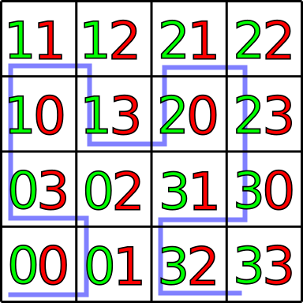

## Library File

      HilbertDraw.py

## About

HilbertDraw is a library for drawing a version of an image using a
non-intersecting curve based on iterations approximating Hilbert's
Curve.

For example, consider the following drawing of the mathematician David
Hilbert.

The output after processing this with HilbertDraw is

HilbertDraw.py works best with "cartoon-like" drawings that don't have
much detail. Furthermore, some pre-processing of colors may be
necessary. Small areas and fine details should be in darker
colors. Larger areas lacking detail may have lighter colors, depending
on preference.

## Pseudo-Hilbert Curves

The Hilbert curve is a special type of poorly behaved continuous function, in particular it is a continuous
function from a 1D set that fills in an entire 2D square. What is important for us, is that the Hilbert curve
is built in steps using curves called **pseudo-Hilbert curves**. These come in levels denoted by numbers 0, 1, 2,...
To understand them, it is best to just look at some pictures:

We start by taking a square and sub-dividing it into four equal parts. In the each consecutive step we sub-divide each square again into four more equal parts. So we have that

* For level 0, the square is divided into 4 parts.
* For level 1, the square is divided into 16 parts.
* For level 2, the square is divided into 64 parts.
* For level 3, the square is divided into 256 parts.

The new sub-squares are given an ordering based on an orientation assigned to the square it originally came from. The ordering preserves the ordering of the squares it comes from (so the ordering of each level is added on top of each other similar to the use of ordering in the alphabet in lexical ordering). This is best seens with some pictures:

So we see that at each step we need to keep track of the orientation of each sub-square. 

The pseudo-Hilbert curve at each level is constructed by connecting the lower left corners of the squares in the order that we assign for that level.

## Pseudo-Hilbert Curves For an Image 

To render an image, the iterations are carried to different depths for
different parts of the image. This is implemented as a tree where each
node is one of the rectangles occurring in some stage the
iterations. The leaves are rectangles that will not be
sub-divided. The decision as to which rectangles should be sub-divided
is based on the level of color in the image. **Darker colors give more
sub-division**.
